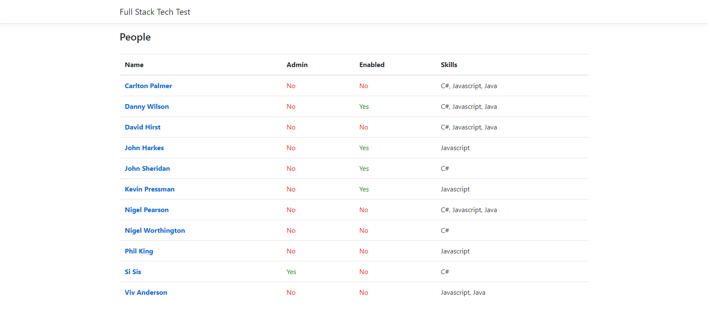
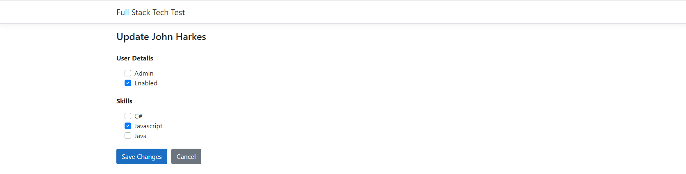
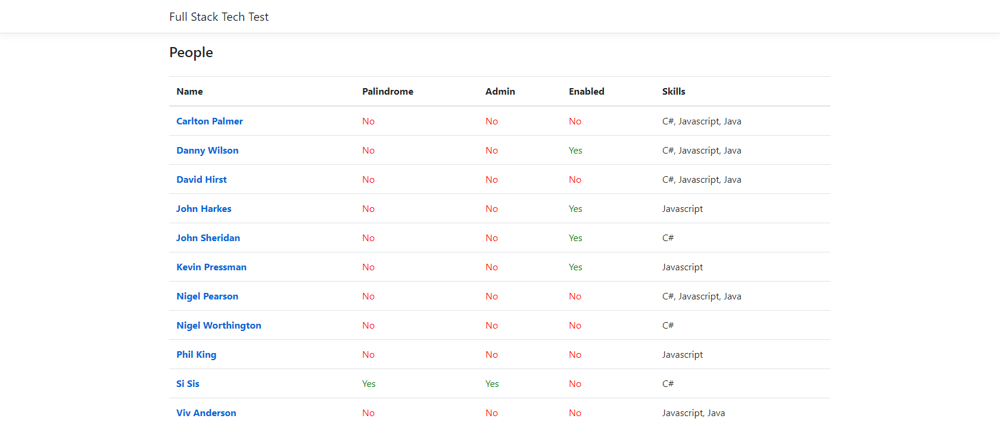

# Full Stack Technical Test

This test requires that you use the scaffolded application to build functionality inline with the instructions below. The initial structure of the application is based on ASP.NET Core [React project template](https://docs.microsoft.com/en-us/aspnet/core/client-side/spa/react?view=aspnetcore-3.0&tabs=visual-studio), feel free do add any additional libraries you want to use. 

Please clone the project and create your own repository from it, do not branch from this project. Once you are ready, send a link to the repository you have created so that it can be reviewed.

## Prerequisites

This test requires a SQL Server database, if not already installed, a free version can be downloaded [here](https://www.microsoft.com/en-gb/sql-server/sql-server-editions-express).

## Test Steps

1. Create a database in SQL Server using the script in the root folder (db-schema.sql).
2. Scaffold Entity Framework models from the database.
3. In the React app, create a table for a list of people and make a call back to the server to retrieve the data from the database created in the previous steps. The end result should look similar to the following example:
   

4. Add functionality to the persons name so that when it's clicked the user gets a view of the data for that individual as shown below:
   
 
5. Add the necessary functionality so that the information can be changed, saved back to the server and the database.
6. When a successful response has been saved the user should be returned to the original list and the list should be updated with the changes.
7. Add an extra column to the list to indicate if a persons full name can be spelt the same whether it is forwards or backwards, Ignoring spaces and case:
   
 

** Extra ** 
Use your skills to add any additional features / functionality you think would be useful in the app.